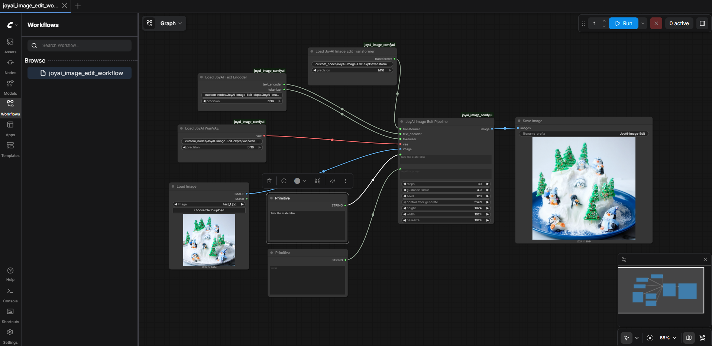

# JoyAI-Image for ComfyUI

### Introduction

This folder is the ComfyUI integration of JoyAI-Image, supporting Image Editing mode.

**Features**:
- ✨ Image Editing
- ✨ Plug-and-play Workflow

**Display**:



### Quick Start

#### 1. Requirements

Follow the requirements of JoyAI-Image:

- **transformers**: >=4.57.0,<4.58.0
- **diffusers**: 0.36.0

#### 2. Installation Steps

**Step 1: Clone JoyAI-Image Repository**

```bash
cd ComfyUI/custom_nodes
git clone https://github.com/jd-opensource/JoyAI-Image.git
cp -r JoyAI-Image/joyai_image_comfyui ./
cp JoyAI-Image/joyai_image_comfyui/joyai_image_edit_workflow.json ../user/default/workflows/
```

**Step 2: Download Model Weights**

Download the model weights from [Hugging Face](https://huggingface.co/jdopensource/JoyAI-Image-Edit) and organize them as follows:

```
ComfyUI/custom_nodes/
├── JoyAI-Image/
├── joyai_image_comfyui/
└── JoyAI-Image-Edit-ckpts/         ← Weights directory
    ├── transformer/
    │   └── transformer.pth
    ├── vae/
    │   └── Wan2.1_VAE.pth
    └── JoyAI-Image-Und/
        ├── config.json
        ├── model.safetensors
        └── ...
```

**Step 3: Restart ComfyUI**

```bash
# ComfyUI will automatically load the new nodes
```

#### 3. Using the Workflow

1. Open ComfyUI
2. Navigate to Menu → Workflows
3. Select `joyai_image_edit_workflow.json` to load the workflow
